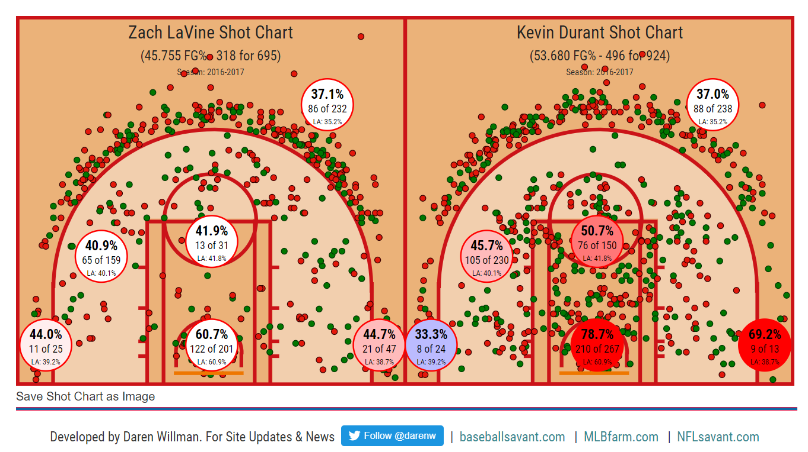

An example of data science to me would be using the coordinates of NBA players and their field goal percentage at that location to determine in which general areas of the court that player is the most effective shooter. This example compares the shot charts of **Zach Lavine** and **Kevin Durant** from the **2016-2017** NBA season. The larger bubbles represents the general areas of the court: the paint, mid-range, left corner 3pt, etc.

Source website : [NBA Player Shot Maps](http://nbasavant.com/apps/compare.php)


```{r}
version
```


